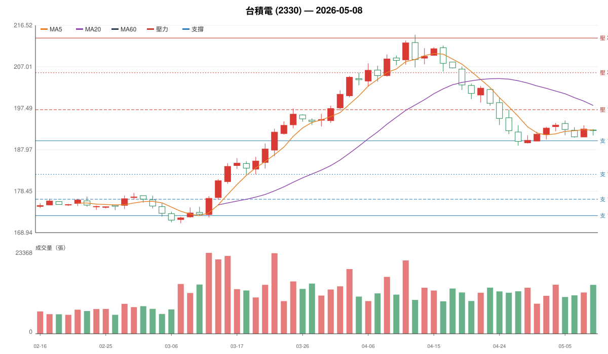
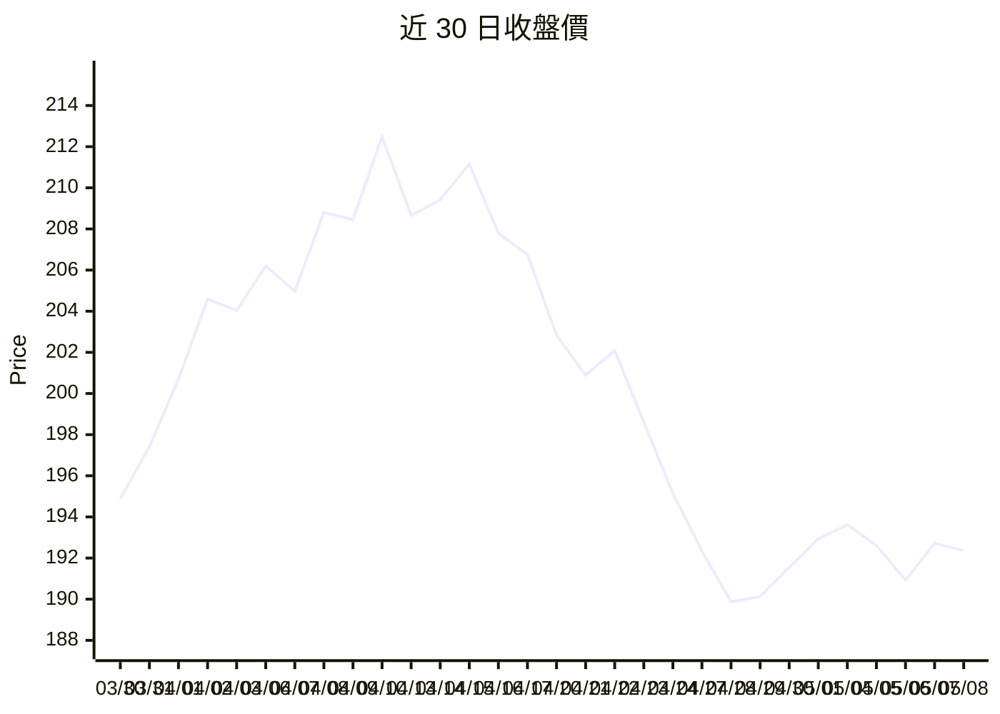
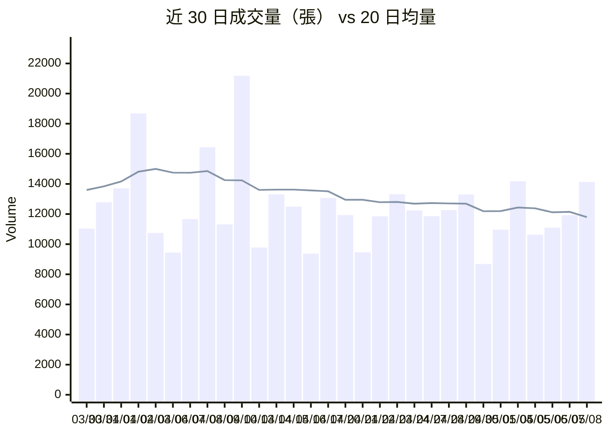
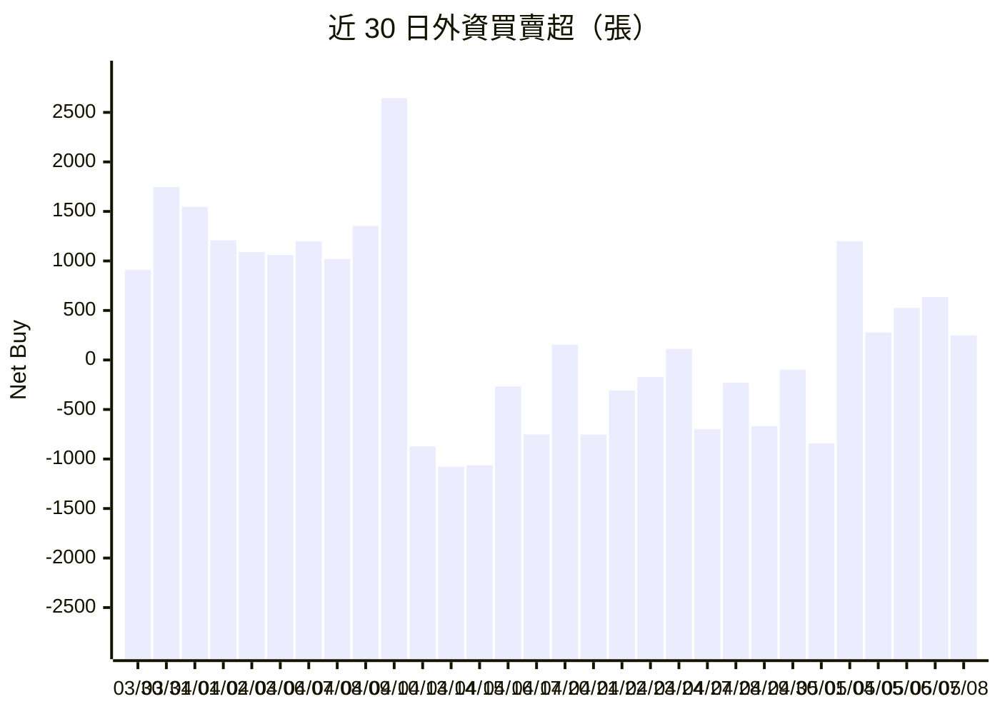
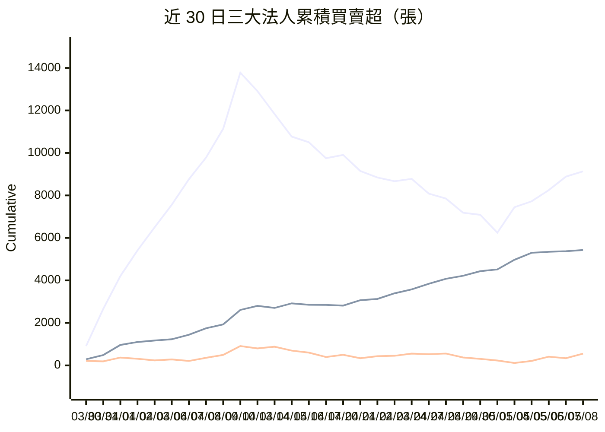
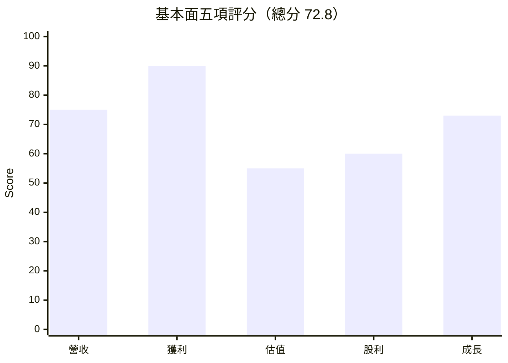

# 股票分析報告：台積電 (2330)

> 分析日期：2026-05-08

本報告並非投資建議，而是提供一套可重複使用的分析框架。

## 一、總結判斷

- 最新收盤：192.37
- 目前趨勢：回檔修正
- 短線評價：BULLISH / 建議動作：BUY
- 中線評價：NEUTRAL / 建議動作：WAIT
- 長線評價：BULLISH / 建議動作：BUY
- 基本面總分：72.8（基本面良好）
- 主要風險：跌破第一支撐且站不回；反彈量縮且留長上影；三大法人連續賣超

## 二、K 線 / 均線 / 支撐壓力總覽

## 三、趨勢位置

目前階段：**回檔修正**

- 5 日均線：192.45
- 10 日均線：191.91
- 20 日均線：198.12
- 60 日均線：190.14
- 位於 60 日區間位置：49.2%
- 距 60 日高：-10.26%
- 距 60 日低：12.43%

判斷理由：
- 自 60 日高點回落超過 10%
- 已跌破 20 日均線但尚未跌破季線

## 四、K 線訊號

近 5 日 K 線訊號：

| 日期 | 開 | 高 | 低 | 收 | 訊號 |
|---|---:|---:|---:|---:|---|
| 2026-05-04 | 193.25 | 194.12 | 192.19 | 193.62 | 長下影線（支撐區出現代表低檔有承接，偏向止跌訊號）、十字線（多空拉鋸，需等後續方向確認） |
| 2026-05-05 | 193.98 | 194.65 | 191.29 | 192.61 | 無明顯 K 線訊號 |
| 2026-05-06 | 192.43 | 193.14 | 190.73 | 190.92 | 強黑 K（賣壓積極，若搭配放量與法人賣超為轉弱訊號） |
| 2026-05-07 | 190.88 | 193.57 | 190.86 | 192.72 | 無明顯 K 線訊號 |
| 2026-05-08 | 192.49 | 192.69 | 191.25 | 192.37 | 長下影線（支撐區出現代表低檔有承接，偏向止跌訊號）、十字線（多空拉鋸，需等後續方向確認） |

最新 K 線解讀：長下影線（支撐區出現代表低檔有承接，偏向止跌訊號）、十字線（多空拉鋸，需等後續方向確認）

## 五、成交量分析

近 5 日成交量觀察：

| 日期 | 量 | 5日均量比 | 20日均量比 | 訊號 |
|---|---:|---:|---:|---|
| 2026-05-04 | 1.42 萬張 | 1.19 | 1.14 | 成交量無顯著訊號 |
| 2026-05-05 | 1.06 萬張 | 0.92 | 0.86 | 成交量無顯著訊號 |
| 2026-05-06 | 1.11 萬張 | 1.00 | 0.92 | 成交量無顯著訊號 |
| 2026-05-07 | 1.19 萬張 | 1.01 | 0.98 | 成交量無顯著訊號 |
| 2026-05-08 | 1.41 萬張 | 1.14 | 1.20 | 成交量無顯著訊號 |

## 六、法人籌碼分析

近 5 日三大法人買賣超（單位：張）：

| 日期 | 外資 | 投信 | 自營 | 合計 | 訊號 |
|---|---:|---:|---:|---:|---|
| 2026-05-04 | 1199 | 453 | -116 | 1536 | 投信連續買超 |
| 2026-05-05 | 278 | 330 | 98 | 706 | 投信連續買超、三大法人同步買超 |
| 2026-05-06 | 525 | 46 | 199 | 770 | 外資連續買超、投信連續買超、三大法人同步買超 |
| 2026-05-07 | 636 | 28 | -73 | 591 | 外資連續買超、投信連續買超 |
| 2026-05-08 | 248 | 55 | 216 | 519 | 外資連續買超、投信連續買超、三大法人同步買超 |

近 20 日合計：
- 外資：-4648 張
- 投信：2819 張
- 自營商：-357 張
- 三大法人合計：-2186 張

## 七、基本面分析

總評：**基本面良好**（總分 72.8 / 100）

| 項目 | 分數 |
|---|---:|
| 營收成長 | 75 |
| 獲利能力 | 90 |
| 估值 | 55 |
| 股利 | 60 |
| 成長動能 | 73 |

觀察重點：
- 月營收年增率明顯成長

## 八、支撐與壓力

### 壓力區

| 價格 | 強度 | 原因 |
|---:|---|---|
| 197.15 | MEDIUM | 長上影線高點；20 日均線反壓 |
| 205.64 | WEAK | 長上影線高點 |
| 213.59 | STRONG | 長上影線高點；近 60 日最高點；近 20 日高點 |

### 支撐區

| 價格 | 強度 | 原因 |
|---:|---|---|
| 190.02 | STRONG | 大量紅 K 起漲點；近 20 日低點；60 日均線支撐；長下影線低點；10 日均線支撐 |
| 182.33 | WEAK | 長下影線低點 |
| 176.59 | MEDIUM | 長下影線低點；大量紅 K 起漲點 |
| 172.84 | STRONG | 近 60 日最低點；長下影線低點；大量紅 K 起漲點 |

## 九、短線策略（1 - 10 個交易日）

**短線評價：BULLISH；建議動作：BUY**

原因：
- 支撐區出現長下影承接訊號
- 近 5 日外資合計未呈現連續賣超

買進區：

| 動作 | 價格區 | 建議部位 | 原因 |
|---|---:|---:|---|
| BUY | 187.17 - 192.87 | 20% | 第一支撐測試不破且出現止跌訊號 |

停利區：

| 動作 | 價格區 | 建議部位 | 原因 |
|---|---:|---:|---|
| TAKE_PROFIT | 195.18 - 199.12 | 30% | 第一壓力區，若量縮或長上影先減碼 |
| TAKE_PROFIT | 203.58 - 207.70 | 30% | 第二壓力區，若爆量不漲繼續減碼 |

停損區：

| 動作 | 價格區 | 建議部位 | 原因 |
|---|---:|---:|---|
| STOP_LOSS | 183.40 - 185.24 | 100% | 跌破第一支撐 3% 以上確認破位 |

轉弱 / 撤退訊號：
- 跌破第一支撐且站不回
- 反彈量縮且留長上影
- 三大法人連續賣超

## 十、中線策略（2 週 - 3 個月）

**中線評價：NEUTRAL；建議動作：WAIT**

原因：
- 等待趨勢明朗

停利區：

| 動作 | 價格區 | 建議部位 | 原因 |
|---|---:|---:|---|
| TAKE_PROFIT | 194.19 - 200.11 | 30% | 反彈至中期壓力區先減碼 |

停損區：

| 動作 | 價格區 | 建議部位 | 原因 |
|---|---:|---:|---|
| STOP_LOSS | 172.35 - 174.08 | 100% | 跌破次級支撐 5% 中期趨勢轉弱 |

轉弱 / 撤退訊號：
- 跌破中期支撐且放量黑 K
- 外資連續 5 - 10 日賣超
- 月營收連續兩個月年增轉弱
- 反彈站不回前支撐

## 十一、長線策略（3 個月以上）

**長線評價：BULLISH；建議動作：BUY**

原因：
- 基本面佳且股價處於回檔或調整，長線佈局機會

買進區：

| 動作 | 價格區 | 建議部位 | 原因 |
|---|---:|---:|---|
| BUY | 186.22 - 193.82 | 30% | 長線第一批：合理估值區 |
| ADD | 177.77 - 186.89 | 40% | 長線第二批：安全邊際區 |

轉弱 / 撤退訊號：
- 月營收連續 2 - 3 個月年增轉負
- EPS 顯著下修
- 毛利率連續衰退
- 產業題材未轉化為實際營收
- 高本益比但成長停滯
- 跌破長期支撐且站不回

## 十二、分批買入計畫

規劃部位合計：100%

| 動作 | 價格區 | 建議部位 | 原因 |
|---|---:|---:|---|
| BUY | 187.17 - 192.87 | 25% | 第一批：短線支撐測試不破且出現止跌訊號 |
| ADD | 178.68 - 185.98 | 25% | 第二批：站回關鍵壓力或次級支撐承接 |
| ADD | 173.06 - 180.12 | 25% | 第三批：中期合理估值區，基本面未轉弱 |
| ADD | 168.52 - 177.16 | 25% | 第四批：長線安全邊際區，基本面仍佳 |

禁止加碼條件：
- 跌破支撐後尚未站回
- 法人連續賣超
- 反彈量縮 / 長上影
- 基本面轉弱
- 只是為了攤平虧損

## 十三、分批賣出計畫

目前建議持有部位：50%

| 動作 | 價格區 | 建議部位 | 原因 |
|---|---:|---:|---|
| REDUCE | 195.18 - 199.12 | 25% | 第一批：反彈至第一壓力且量縮或長上影 |
| REDUCE | 203.58 - 207.70 | 35% | 第二批：反彈至高檔壓力且爆量不漲 |
| SELL | 210.39 - 216.79 | 25% | 第三批：突破前高失敗，確認為假突破 |

強制減碼條件：
- 跌破短線支撐
- 跌破中期支撐
- 放量黑 K
- 三大法人同步賣超
- 外資連續賣超
- 基本面轉弱

## 十四、風險訊號

若出現以下訊號，應重新評估持有：
- 跌破第一支撐且站不回
- 反彈量縮且留長上影
- 三大法人連續賣超
- 跌破中期支撐且放量黑 K
- 外資連續 5 - 10 日賣超
- 月營收連續兩個月年增轉弱
- 反彈站不回前支撐
- 月營收連續 2 - 3 個月年增轉負
- EPS 顯著下修
- 毛利率連續衰退
- 產業題材未轉化為實際營收
- 高本益比但成長停滯
- 跌破長期支撐且站不回
